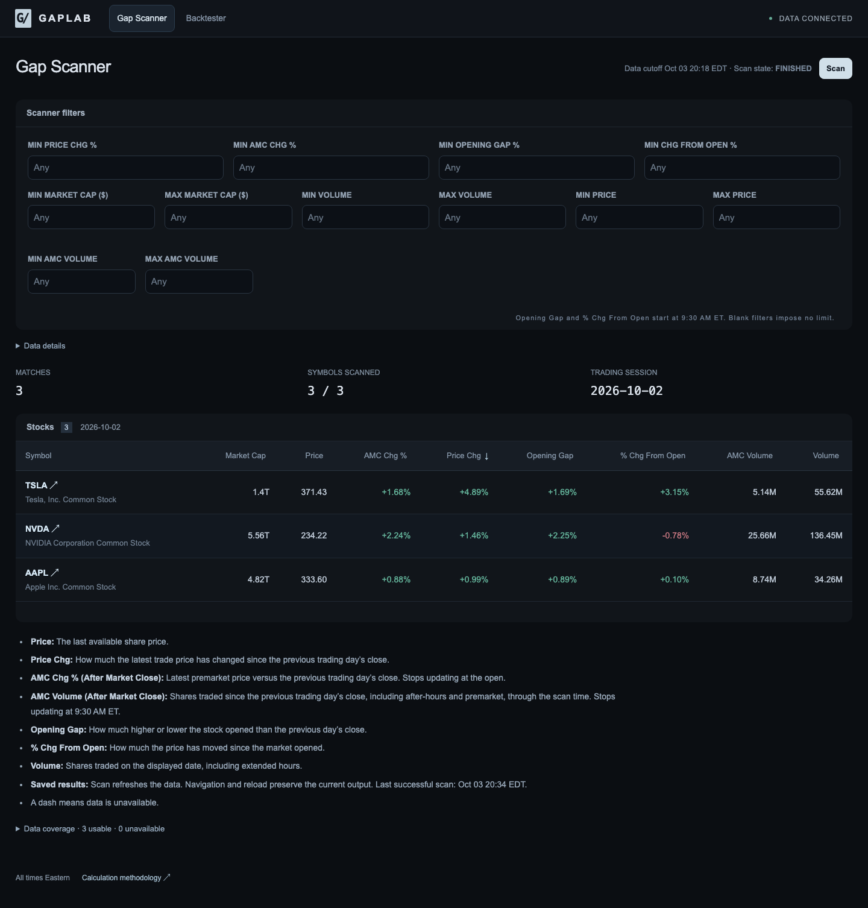
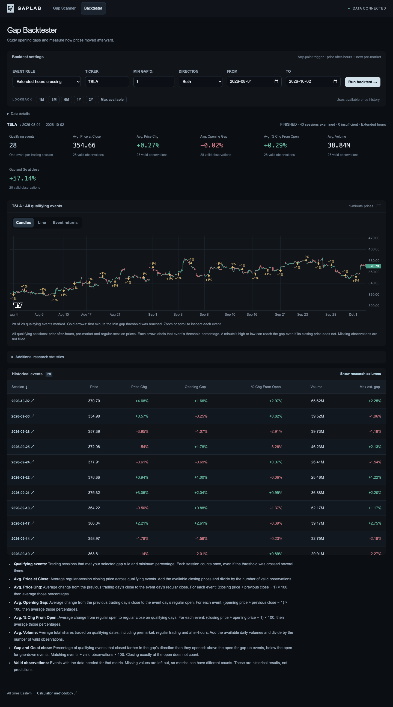

<div align="center">

# GAPLAB

### Find the gap. Study what followed.

**A US equity scanner and historical gap research workstation.**

Real Alpaca market data · Transparent calculations · Persistent workspaces


[Scanner](#gap-scanner) · [Backtester](#historical-backtester) · [Quick start](#quick-start) · [Verification](#verification)

</div>

---

Gaplab brings two research workflows into a dark, focused trading workspace: discover stocks making meaningful moves, then study how the same stock behaved after similar gaps in the past. Every financial value comes from available source data. Missing observations stay missing.

## Gap Scanner



Scan the eligible Alpaca US-equity universe with bounded bulk requests, then narrow the results using independent filters. There is no hidden requirement that price must remain above the opening price.

- **Flexible filters:** minimum Price Chg %, AMC Chg %, Opening Gap %, and Change From Open %; min/max market cap in dollars, price, day volume, and AMC volume.
- **Sortable results:** compare price movement, company size, and trading activity using full-precision values, with prices displayed to two decimal places.
- **Ticker research:** open Yahoo Finance directly, inspect a stock in the detail drawer, or send its ticker to the backtester.
- **A workspace that remembers:** navigation preserves inputs, results, and running jobs. Reload restores saved output without starting a new price scan.
- **Clear coverage:** inspect unavailable symbols and data limitations without scrolling through thousands of repeated errors.

### What the columns measure

| Column | Calculation or source |
| --- | --- |
| **Market Cap** | Reported Nasdaq market capitalization; current source values, not historical valuations. |
| **Price** | Latest available traded price, including eligible premarket or after-hours trades. |
| **AMC Chg %** | Last completed premarket close ÷ adjusted previous regular close − 1, multiplied by 100. Uses 4:00–9:30 AM ET bars and freezes at the open. |
| **Price Chg** | Latest traded price ÷ adjusted previous regular close − 1, multiplied by 100. |
| **Opening Gap** | Regular opening price ÷ adjusted previous regular close − 1, multiplied by 100. |
| **% Chg From Open** | Latest traded price ÷ regular opening price − 1, multiplied by 100. |
| **AMC Volume** | Sum of completed minute-bar volumes from the previous trading session’s regular close to today’s open, capped by the scan time. Includes prior after-hours and current premarket. |
| **Volume** | The provider’s cumulative volume for the displayed date, including that date’s extended-hours trading. |

**AMC** means **After Market Close** in the interface. The change and volume columns have the specific windows above; they are not a separate live after-hours percentage against today’s closing price. Opening-based metrics become available after the regular open. Blank filters impose no restriction; active filters exclude unavailable values for that metric.

Older saved results can backfill missing AMC fields at their **original cutoff time**, without replacing their saved quotes. Successful batches appear as they finish; failed requests expose a retry control.

## Historical Backtester



Ask a precise question: **when this stock met my gap threshold, what happened afterward?**

| Event rule | What qualifies |
| --- | --- |
| **Opening gap** | The regular opening price meets the selected gap threshold against the previous trading day’s regular close. |
| **Extended-hours crossing** | Any eligible minute in prior after-hours or the following premarket reaches the threshold. An event still counts if the move fades before the open. |

Select a ticker, direction, threshold, and date range. Each trading session counts once. The study reports average closing price, price change, opening gap, open-to-close change, daily volume, and the frequency of continuation at the close.

- **All-event price charts:** candle and line views combine every qualifying session; gold arrows mark each available first threshold-crossing minute. Zoom and scroll to examine individual sessions.
- **Event returns:** compare historical open-to-close outcomes by event date.
- **Detailed event audits:** inspect threshold prices, observed crossings, gap fills, continuation, favorable/adverse excursions, and source coverage.
- **Honest denominators:** each statistic shows its valid-observation count. Missing outcomes never become zeros or fabricated records.

Crossings are observed one-minute bars, not exact trade timestamps. Historical frequencies describe the sample; they are not predicted returns or an execution simulation. Gaplab does not place trades.

## Quick Start

Requires **Node.js 22+**, npm, and Alpaca credentials with access to the selected market-data feed.

```sh
git clone https://github.com/mthavarajah/gaplab.git
cd gaplab
npm ci
cp .env.example .env.local
```

Set the server-side variables in `.env.local`:

```dotenv
ALPACA_API_KEY=your_key
ALPACA_API_SECRET=your_secret
ALPACA_TRADING_URL=https://paper-api.alpaca.markets
ALPACA_FEED=sip
ALPACA_DELAY_MINUTES=16
```

The delayed SIP configuration offers broader exchange coverage where the account permits it. Use a zero delay only with the required real-time entitlement. IEX is supported but covers one venue and may have sparse extended-hours observations. Feed access and historical coverage depend on the account; the app does not silently substitute another feed.

```sh
npm run dev
```

Open **http://127.0.0.1:3000**. For a production build:

```sh
npm run build
npm run start
```

### Optional database

Set `DATABASE_URL` to a Neon or Supabase Postgres connection string, then run:

```sh
npm run db:migrate
```

Without Postgres, the server uses a bounded process cache. Browser workspace persistence is separate and uses IndexedDB. Credentials stay server-side and are never stored in the browser workspace.

### Vercel

Import the repository as a Next.js project and configure the same server-side environment variables in Vercel. Add `DATABASE_URL` if durable server caching is desired. Function duration limits, provider rate limits, and account entitlements still apply; browser refresh interrupts a running job and restores its saved partial output.

## Engineering

| Layer | Technology |
| --- | --- |
| Application | Next.js App Router, React, TypeScript |
| Tables and requests | TanStack Table, TanStack Query |
| Price charts | Lightweight Charts |
| Market data | Server-side Alpaca REST requests; Nasdaq bulk market caps |
| Session handling | Luxon, US Eastern time, provider trading calendars |
| Persistence | Browser IndexedDB; optional Postgres with Drizzle |
| Validation | Vitest, live provider checks, Playwright, independent source audits |

Financial calculations live in shared deterministic functions. Calendar handling accounts for trading holidays, weekends, daylight-saving transitions, and session boundaries. Bulk requests, bounded concurrency, pagination, caching, and rate-limit-aware retries keep the universe practical.

```text
src/app/          Pages and server API routes
src/components/   Scanner, backtester, charts, and persistent workspace state
src/lib/domain/   Financial calculations, session logic, and validation
src/lib/provider/ Alpaca and market-cap access
src/lib/client/   Browser workflows and saved-result enrichment
src/lib/db/       Optional database and caching
scripts/          Independent source audits and visual checks
tests/            Calculation, integration, and browser workflows
```

## Verification

```sh
npm test
npm run typecheck
npm run lint
npm run build
npm run test:live
```

Live checks require real provider credentials. To generate the source artifacts used by browser tests:

```sh
npm run verify:live
node --conditions=react-server --import tsx scripts/verify-opening.ts
node --conditions=react-server --import tsx scripts/verify-premarket.ts
node --conditions=react-server --import tsx scripts/verify-market-caps.ts
npm run test:e2e
```

Independent checks recompute results from source bars and compare them with app output. Playwright covers filters, sorting, ticker handoff, saved workspaces, charts, missing data, and recovery from provider errors. Source artifacts and browser captures remain local under ignored `artifacts/` directories.

See [the validation record](docs/VALIDATION.md) for scope and evidence, and the app’s **Calculation methodology** page for detailed definitions. Screenshots show captured observations and are not live quotes.
